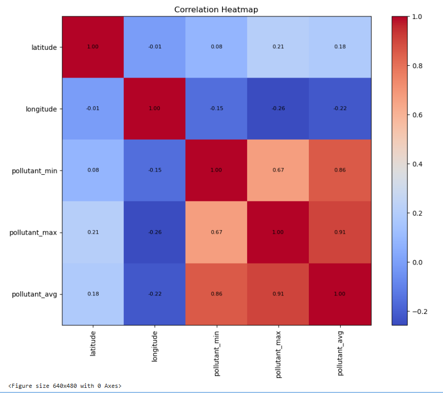
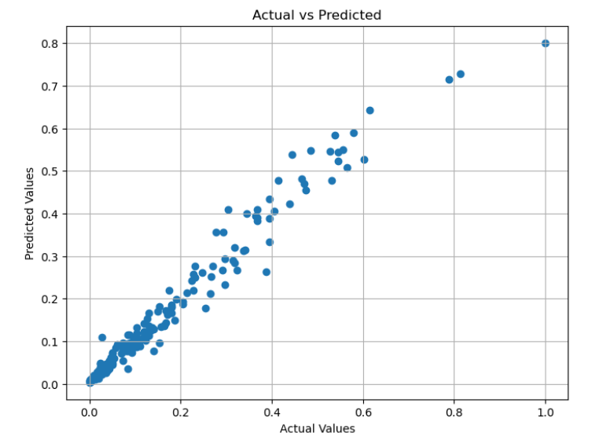
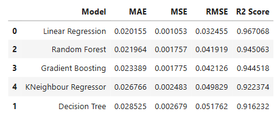

# Air Quality Prediction using Machine Learning

## Project Overview
This project focuses on predicting air pollution levels using machine learning models trained on real-time air quality data.  
The goal is to analyze pollutant patterns and build an accurate predictive model to support environmental monitoring and decision-making.

---

## Visualizations

### Correlation Heatmap
This heatmap shows the relationship between different features. Strong positive correlation is observed between pollutant values.

# Air Quality Prediction using Machine Learning

## Project Overview
This project focuses on predicting air pollution levels using machine learning models trained on real-time air quality data.  
The goal is to analyze pollutant patterns and build an accurate predictive model to support environmental monitoring and decision-making.

---

## Visualizations

### Correlation Heatmap
This heatmap shows the relationship between different features. Strong positive correlation is observed between pollutant values.



---

### Actual vs Predicted Values
This plot demonstrates the accuracy of the model. Points closer to the diagonal indicate better predictions.



---

### Model Performance Comparison
Comparison of multiple machine learning models based on evaluation metrics.



---

## Models Used
- Linear Regression  
- Decision Tree Regressor  
- Random Forest Regressor  
- K-Nearest Neighbors (KNN)  
- Gradient Boosting Regressor  

---

## Evaluation Metrics
- R² Score  
- Mean Absolute Error (MAE)  
- Mean Squared Error (MSE)  
- Root Mean Squared Error (RMSE)  

---

## Results
Linear Regression achieved the best performance with the highest R² score (~0.96), indicating strong linear relationships in the dataset.

---

## Technologies Used
- Python  
- Pandas, NumPy  
- Matplotlib, Seaborn  
- Scikit-learn  

---

## Dataset
The dataset contains real-time air quality data including:
- Latitude  
- Longitude  
- Pollutant Min, Max, and Average values  

---

## How to Run

1. Clone the repository:
   ```bash
   git clone https://github.com/your-username/air-quality-prediction-ml.git

---

### Actual vs Predicted Values
This plot demonstrates the accuracy of the model. Points closer to the diagonal indicate better predictions.


---

### Model Performance Comparison
Comparison of multiple machine learning models based on evaluation metrics.


---

## Models Used
- Linear Regression  
- Decision Tree Regressor  
- Random Forest Regressor  
- K-Nearest Neighbors (KNN)  
- Gradient Boosting Regressor  

---

## Evaluation Metrics
- R² Score  
- Mean Absolute Error (MAE)  
- Mean Squared Error (MSE)  
- Root Mean Squared Error (RMSE)  

---

## Results
Linear Regression achieved the best performance with the highest R² score (~0.96), indicating strong linear relationships in the dataset.

---

## Technologies Used
- Python  
- Pandas, NumPy  
- Matplotlib, Seaborn  
- Scikit-learn  

---

## Dataset
The dataset contains real-time air quality data including:
- Latitude  
- Longitude  
- Pollutant Min, Max, and Average values  

---

## How to Run

1. Clone the repository:
   ```bash
   git clone https://github.com/your-username/air-quality-prediction-ml.git
